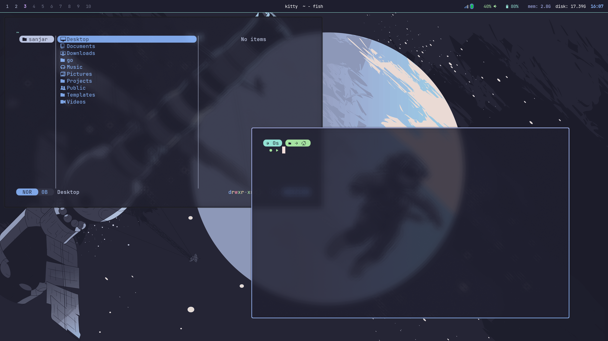

# My Simple Hyprland dotfiles

## Preview

## My prefered programs

Bar: [waybar](https://github.com/Alexays/Waybar)

Application Launcher: [rofi](https://github.com/davatorium/rofi)

Text Editor: [neovim](https://neovim.io/)

Terminal: [kitty](https://sw.kovidgoyal.net/kitty/)

Network: [nm-applet](https://man.archlinux.org/man/nm-applet.1.en)

Bluetooth: [blueman](https://github.com/blueman-project/blueman)

Audio: [pavucontrol](https://github.com/pulseaudio/pavucontrol)

Shell: [fish](https://fishshell.com/)

File Manager: [yazi](https://yazi-rs.github.io/docs/installation/)

Notifications: [swaync](https://github.com/ErikReider/SwayNotificationCenter)

Wallpaper: [waypaper](https://github.com/anufrievroman/waypaper) and [awww](https://codeberg.org/LGFae/awww)

Screenshots: [satty](https://github.com/Satty-org/Satty), [grim](https://gitlab.freedesktop.org/emersion/grim) and [slurp](https://github.com/emersion/slurp)

Clipboard history: [cliphist](https://github.com/sentriz/cliphist)

Authentication Agent: [hyprpolkitagent](https://wiki.hypr.land/Hypr-Ecosystem/hyprpolkitagent)

